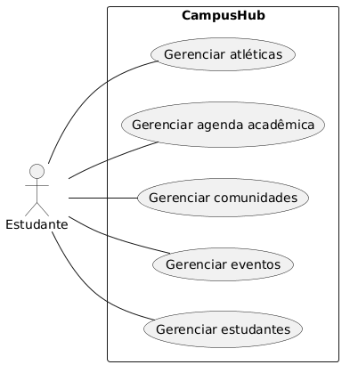
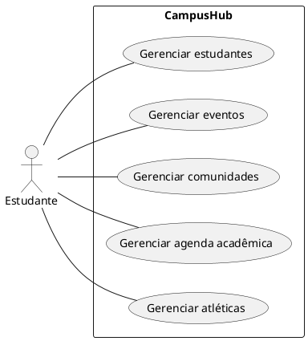

# Casos de uso

## Código PlantUML

[Arquivo fonte](casos-de-uso.uml)

```plantuml
@startuml
left to right direction

actor Estudante as E

rectangle CampusHub {
    usecase "Gerenciar estudantes" as S
    usecase "Gerenciar eventos" as EV
    usecase "Gerenciar comunidades" as C
    usecase "Gerenciar agenda acadêmica" as AA
    usecase "Gerenciar atléticas" as AT
}

E -- S
E -- EV
E -- C
E -- AA
E -- AT
@enduml
```
