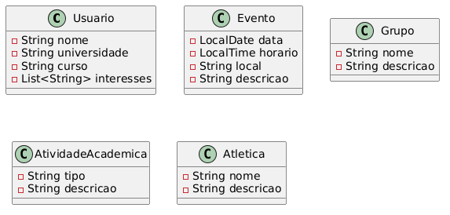
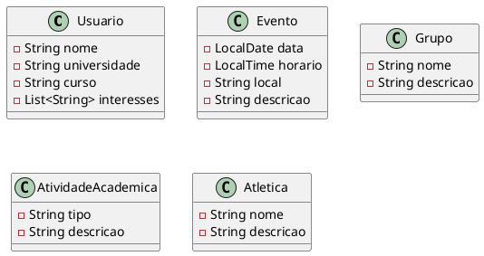

# Classes

## Código PlantUML

[Arquivo fonte](classes.uml)

```plantuml
@startuml

class Usuario {
    -String nome
    -String universidade
    -String curso
    -List<String> interesses
}

class Evento {
    -LocalDate data
    -LocalTime horario
    -String local
    -String descricao
}

class Grupo {
    -String nome
    -String descricao
}

class AtividadeAcademica {
    -String tipo
    -String descricao
}

class Atletica {
    -String nome
    -String descricao
}

@enduml
```
